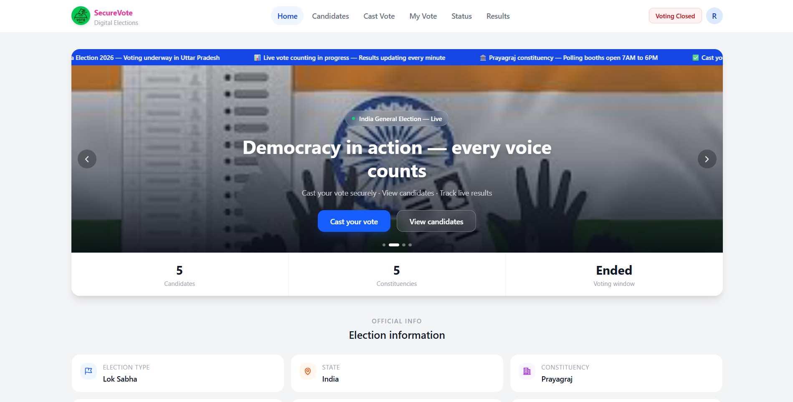
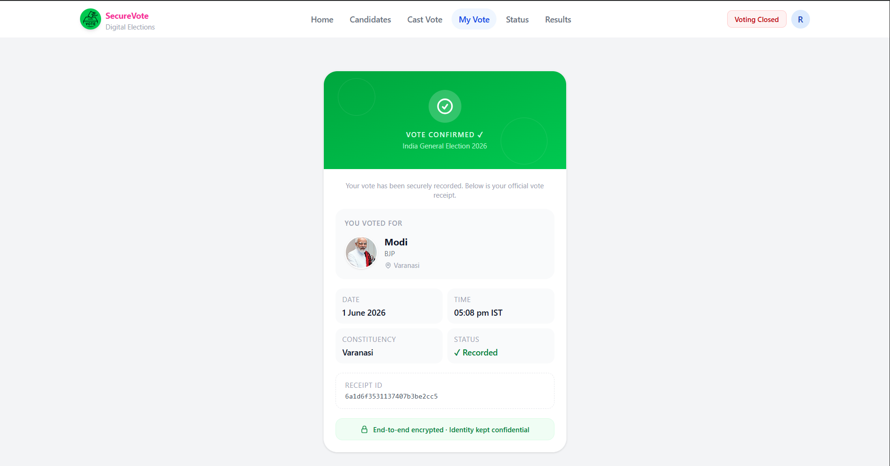
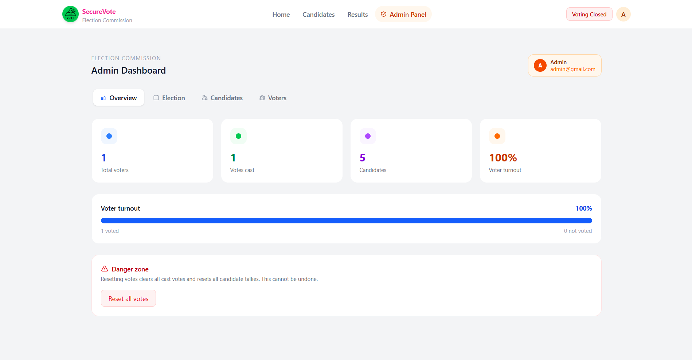

# 🗳️ SecureVote — Digital Election System

A full-stack secure online voting system built for real-world election scenarios. Supports constituency-based candidate filtering, JWT authentication, admin controls, and atomic vote transactions.

> Built by [Mohit Kumar](https://github.com/mohit-kumar-cse) · B.Tech CSE · Placement Project 2026

---

## 🚀 Live Demo

> _Coming soon — deploying to Render + Vercel_

---

## 📸 Screenshots

| Voter Dashboard | Cast Vote | Admin Panel |
|---|---|---|
|  |  |  |

---

## ✨ Features

### 🧑‍💼 Voter
- Register with Voter ID, Aadhaar (hashed), and constituency
- JWT-based login with 7-day token expiry
- View candidates filtered to their own constituency only
- Cast vote — enforced server-side during active election window only
- View personal vote receipt with candidate details
- Real-time countdown timer (upcoming / live / ended)

### 🛡️ Admin
- Secure admin account (role stored in DB, never accepted from client)
- Dashboard with voter turnout, vote count, candidate stats
- Create / update elections with start and end dates
- Add and delete candidates with photo upload
- View all registered voters
- Reset all votes atomically (votes + candidates + hasVoted flag together)

### 🔒 Security
- Passwords hashed with **bcrypt** (salt rounds: 10)
- Aadhaar hashed before storage — never stored in plaintext
- JWT authentication with role-based route protection
- **Rate limiting** on login/register — 10 attempts per 15 minutes per IP
- **Helmet.js** — secure HTTP headers (XSS, clickjacking, MIME sniffing)
- Constituency validation on server — voters cannot vote outside their area
- Election timing enforced server-side — votes rejected outside window
- MongoDB transactions — vote cast is atomic (vote + candidate count + hasVoted)
- Duplicate vote prevention via unique index at DB level

---

## 🛠️ Tech Stack

### Frontend
| Tech | Version |
|---|---|
| React | 19 |
| React Router DOM | 7 |
| Tailwind CSS | 4 |
| Axios | 1.x |
| Vite | 8 |

### Backend
| Tech | Version |
|---|---|
| Node.js | 18+ |
| Express | 5 |
| MongoDB + Mongoose | 9 |
| JWT (jsonwebtoken) | 9 |
| bcryptjs | 3 |
| Helmet | 8 |
| express-rate-limit | 8 |
| Multer | 2 |

---

## 📁 Project Structure

```
secure-online-voting-system/
│
├── client/                         # React frontend (Vite)
│   └── src/
│       ├── assets/                 # Images (ballot, election photos)
│       ├── components/
│       │   ├── admin/              # OverviewTab, ElectionTab, CandidatesTab, VotersTab, etc.
│       │   ├── candidate/          # CandidateCard, CandidateDetails, CompareCandidates
│       │   ├── common/             # Button, InputField, Loader, Modal, PageTitle
│       │   ├── footer/             # Footer
│       │   ├── home/               # HeroSection, Statistics, CandidatePreview, ElectionInfo
│       │   ├── navbar/             # Navbar, NavLinks, CountdownTimer, ProfileMenu
│       │   ├── results/            # ResultCard, ResultChart, WinnerBanner
│       │   ├── stats/              # StatCard, BottomStats
│       │   └── voting/             # VoteCard, VoteConfirmation, VotingInstructions
│       ├── context/                # AuthContext, ElectionContext
│       ├── hooks/                  # useAuthContext, useElectionContext, useCountdown
│       ├── layouts/                # MainLayout
│       ├── pages/                  # CastVote, MyVote, Results, AdminDashboard, etc.
│       ├── routes/                 # AppRoutes, ProtectedRoute, PublicOnlyRoute
│       ├── services/               # authService, voteService, candidateService, electionService
│       └── utils/                  # api.js (axios instance), formatDate, constants, generateVoteHash
│
└── server/                         # Express backend
    ├── controllers/                # authController, voteController, candidateController
    ├── middleware/                  # authMiddleware, adminMiddleware, uploadMiddleware, errorMiddleware
    ├── models/                     # User, Candidate, Vote, Election
    ├── routes/                     # authRoutes, voteRoutes, candidateRoutes, electionRoutes, adminRoutes
    ├── uploads/                    # Candidate images (served statically)
    └── utils/                      # generateToken, generateHash
```

---

## ⚙️ Setup & Installation

### Prerequisites
- Node.js 18+
- MongoDB Atlas account (free tier works)
- Git

### 1. Clone the repository
```bash
git clone https://github.com/mohit-kumar-cse/secure-voting-system.git
cd secure-voting-system
```

### 2. Setup server
```bash
cd server
npm install
```

Create `server/.env`:
```env
PORT=5000
MONGO_URI=your_mongodb_atlas_connection_string
JWT_SECRET=your_super_secret_key_here
JWT_EXPIRES_IN=7d
CLIENT_URL=http://localhost:5173
NODE_ENV=development
```

### 3. Setup client
```bash
cd ../client
npm install
```

Create `client/.env`:
```env
VITE_API_URL=http://localhost:5000/api
```

### 4. Run the project

In one terminal (server):
```bash
cd server
npm run dev
```

In another terminal (client):
```bash
cd client
npm run dev
```

Open [http://localhost:5173](http://localhost:5173)

---

## 👤 Create Admin Account

Since admin registration is not exposed in the UI (by design), create one directly via MongoDB:

**Step 1** — Generate a bcrypt hash for your password:
```bash
node -e "import('bcryptjs').then(b => b.default.hash('admin123', 10).then(h => console.log(h)))"
```

**Step 2** — Insert admin in MongoDB shell:
```js
db.users.insertOne({
  name: "Admin",
  email: "admin@gmail.com",
  password: "<paste_hash_here>",
  voterId: "ADMIN001",
  aadhaarNumber: "ADMIN_PLACEHOLDER",
  constituency: "Lucknow",
  role: "ADMIN",
  hasVoted: false,
  votedCandidate: null,
  createdAt: new Date(),
  updatedAt: new Date()
})
```

---

## 🗂️ API Endpoints

### Auth
| Method | Endpoint | Access | Description |
|---|---|---|---|
| POST | `/api/auth/register` | Public | Register voter |
| POST | `/api/auth/login` | Public | Login |

### Votes
| Method | Endpoint | Access | Description |
|---|---|---|---|
| POST | `/api/votes/cast` | Voter | Cast vote |
| GET | `/api/votes/my-vote` | Voter | Get own vote receipt |
| GET | `/api/votes/stats` | Public | Get election statistics |

### Candidates
| Method | Endpoint | Access | Description |
|---|---|---|---|
| GET | `/api/candidates` | Protected | Get all candidates |
| POST | `/api/candidates` | Admin | Add candidate |
| DELETE | `/api/candidates/:id` | Admin | Delete candidate |

### Election
| Method | Endpoint | Access | Description |
|---|---|---|---|
| GET | `/api/election/active` | Public | Get active election |
| POST | `/api/election` | Admin | Create election |
| PUT | `/api/election/:id` | Admin | Update election |
| DELETE | `/api/election/:id` | Admin | Delete election |

### Admin
| Method | Endpoint | Access | Description |
|---|---|---|---|
| GET | `/api/admin/stats` | Admin | Dashboard stats |
| GET | `/api/admin/voters` | Admin | All voters |
| POST | `/api/admin/reset-votes` | Admin | Reset all votes |

---

## 🔐 Security Design Decisions

| Concern | Solution |
|---|---|
| Brute force login | Rate limiting — 10 req / 15 min per IP |
| Password storage | bcrypt with salt rounds = 10 |
| Aadhaar storage | bcrypt hashed — never stored in plaintext |
| Token security | JWT with 7d expiry, role embedded in payload |
| Double voting | `hasVoted` flag + unique DB index on voter field |
| Out-of-window voting | Server checks `startDate` / `endDate` on every vote |
| Cross-constituency voting | Server normalizes and compares constituency strings |
| HTTP security | Helmet.js sets Content-Security-Policy, X-Frame-Options, etc. |
| Role escalation | `role` hardcoded to `VOTER` on register — never from `req.body` |

---

## 🧠 Key Implementation Highlights

- **Atomic vote transaction** — uses MongoDB session + `startTransaction()` so vote creation, candidate increment, and `hasVoted` update all succeed or all fail together
- **Constituency normalization** — strips "Lok Sabha" suffix before comparing so `"Ambedkar Nagar"` and `"Ambedkar Nagar Lok Sabha"` match correctly
- **Virtual `status` field** — Election model computes `upcoming / live / ended` from `startDate` / `endDate` at query time — no manual status updates needed
- **Context-driven countdown** — Navbar timer reads from `ElectionContext` and counts down to start or end depending on current time
- **Service layer** — API calls abstracted into `services/` folder, keeping pages clean and logic reusable
- **Custom hooks** — `useAuthContext`, `useElectionContext`, `useCountdown` for clean component code

---

## 📄 License

MIT © [Mohit Kumar](https://github.com/mohit-kumar-cse)